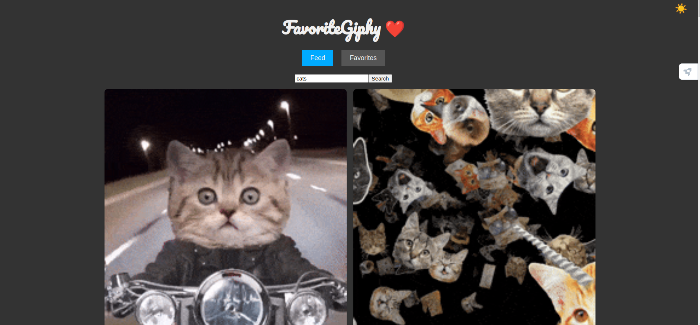

Favorite Giphys

Author: Philipp Sauerländer

Contact: Email: tiamat15@hotmail.de

Github: https://github.com/monty150172/giphy-favorite-app

Giphy Favorite App

Diese Single Page Application ist der Abschluss vom Modul "React"

Dieses Repository enthält eine einfache Webanwendung, die es Benutzern ermöglicht, GIFs von Giphy zu suchen, anzuzeigen und ihre Lieblings-GIFs zu speichern.
Inhalt

    Installation
    Verwendung
    Technologien
    Lizenz

Installation

Um die Anwendung lokal auszuführen, folgen Sie bitte diesen Schritten:

    Klonen Sie das Repository:

`git clone https://github.com/monty150172/giphy-favorite-app.git`

Navigieren Sie in das Verzeichnis der Anwendung:

`cd giphy-favorite-app`

Installieren Sie die notwendigen Abhängigkeiten:

`npm install`

Starten Sie die Anwendung:

    npm run dev

    Die Anwendung wird auf http://localhost:5173 verfügbar sein.

Verwendung

    Suche: Geben Sie einen Suchbegriff in die Suchleiste ein und klicken Sie auf die Schaltfläche "Suchen". Die Anwendung zeigt relevante GIFs von Giphy an.
    Favoriten hinzufügen: Klicken Sie auf ein GIF, um es zu Ihren Favoriten hinzuzufügen.
    Favoriten anzeigen: Klicken Sie auf die Registerkarte "Favoriten", um eine Liste Ihrer gespeicherten GIFs anzuzeigen.

Technologien

Diese Anwendung verwendet die folgenden Technologien:

    React: Frontend-Bibliothek für die Benutzeroberfläche
    Giphy API: Um GIFs basierend auf Suchanfragen zu erhalten
    CSS: Für das Styling der Anwendung

Contributing

Lizenz

Dieses Projekt ist unter der MIT-Lizenz lizenziert – siehe die LICENSE-Datei für Details.
